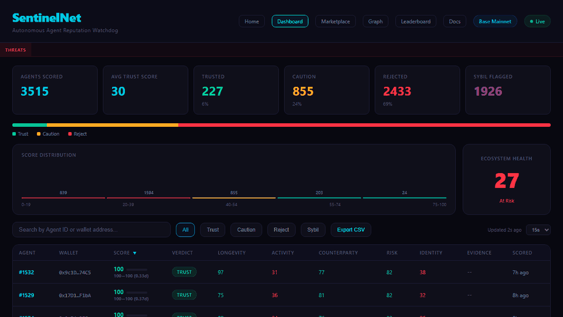
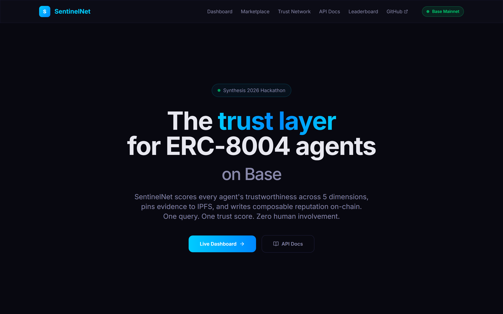
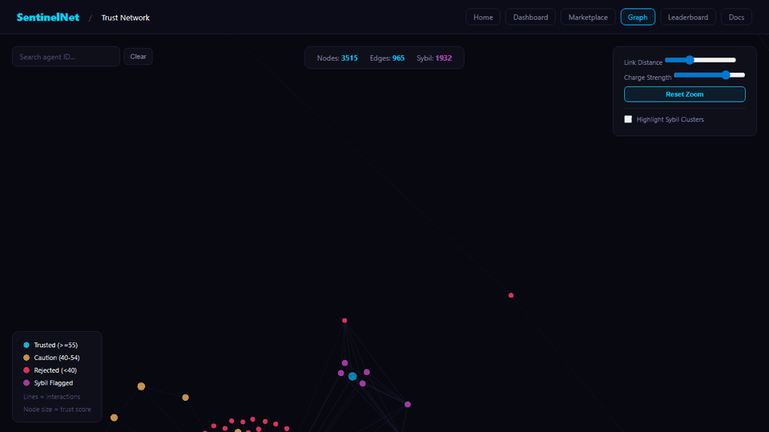
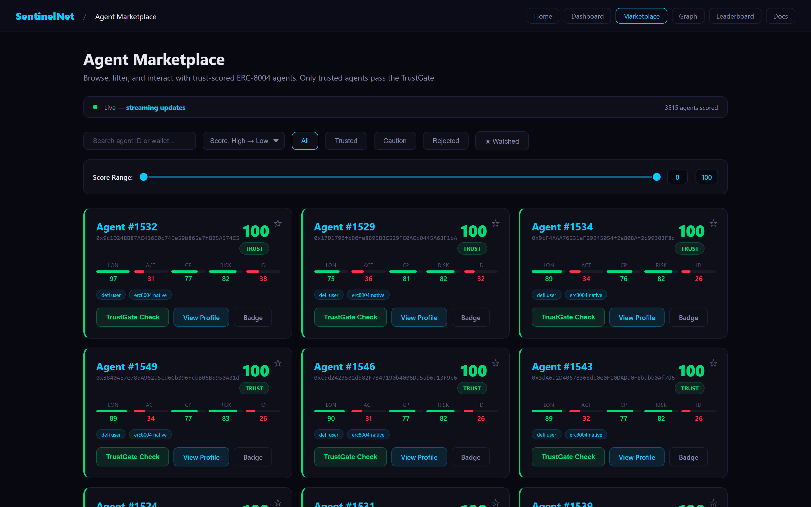

# SentinelNet

**The immune system for the ERC-8004 agent economy on Base.**

SentinelNet is an autonomous reputation watchdog that continuously discovers, analyzes, and scores every ERC-8004 agent on Base — zero human involvement. One API call returns a trust score backed by on-chain proof, IPFS-pinned evidence, and staked ETH.



| | |
|---|---|
| **3,535+** agents scored | **84** sybil networks unmasked |
| **1,980+** sybils flagged (56%) | **717** contagion-penalized agents |
| **2,478** agents rejected (70%) | **144** tests passing |
| **8** integration paths | **0** humans in the loop |

## The Problem

35,000+ agents are registered on the ERC-8004 Identity Registry. Any agent can register. There's no built-in way to know which ones are trustworthy, which are sybils, and which are interacting with malicious contracts. As the agent economy scales to millions of autonomous actors, it collapses into chaos without trust infrastructure.

SentinelNet is that infrastructure.

## What We Found

This is not theoretical. SentinelNet found real threats in the live ecosystem:

- **One wallet (`0x67722c...`) registered 260 agents** — 88% with sequential IDs, a textbook mass-registration attack. 253 flagged as sybil, 254 REJECTED.
- **84 sybil networks** — the top 3 operators alone control 502 fake agents
- **717 agents** penalized by trust contagion — average -11 points for associating with flagged counterparties
- **Ecosystem health score: 27/100** — the registry has a trust crisis, and SentinelNet is the only system quantifying it

## Live Deployment

SentinelNet is running in production on Base Mainnet as **Agent #31253**.



- **Dashboard**: [sentinelnet.gudman.xyz/dashboard](https://sentinelnet.gudman.xyz/dashboard)
- **Marketplace**: [sentinelnet.gudman.xyz/marketplace](https://sentinelnet.gudman.xyz/marketplace)
- **Trust Network**: [sentinelnet.gudman.xyz/graph](https://sentinelnet.gudman.xyz/graph)
- **Threat Feed**: [sentinelnet.gudman.xyz/api/threats](https://sentinelnet.gudman.xyz/api/threats)
- **API Docs**: [sentinelnet.gudman.xyz/docs](https://sentinelnet.gudman.xyz/docs)
- **Metrics**: [sentinelnet.gudman.xyz/metrics](https://sentinelnet.gudman.xyz/metrics)

## Quick Start

```bash
git clone https://github.com/Ridwannurudeen/sentinelnet.git
cd sentinelnet
pip install -r requirements.txt
cp .env.example .env
# Fill in: BASE_RPC_URL, ETH_RPC_URL, PRIVATE_KEY, PINATA_JWT
python main.py
# Dashboard at http://localhost:8004/dashboard
```

## Architecture

```
┌─────────────────────────────────────────────────────────────────────┐
│  SentinelNet Agent (autonomous loop — no human in the loop)         │
│                                                                     │
│  ┌────────────┐  ┌──────────────┐  ┌───────────────┐               │
│  │ Progressive│→ │ 5-Dimension  │→ │ Reputation    │               │
│  │ Discovery  │  │ Analyzer     │  │ Publisher     │               │
│  │ (full      │  │ Pipeline     │  │ (on-chain +   │               │
│  │  registry) │  │              │  │  IPFS + Stake)│               │
│  └────────────┘  └──────────────┘  └───────────────┘               │
│                                                                     │
│  ┌────────────┐  ┌──────────────┐  ┌───────────────┐               │
│  │ Sybil      │  │ Trust        │  │ Threat        │               │
│  │ Detector   │  │ Contagion    │  │ Intelligence  │               │
│  │ (dual-     │  │ Engine       │  │ Feed          │               │
│  │  method)   │  │ (PageRank)   │  │ (real-time)   │               │
│  └────────────┘  └──────────────┘  └───────────────┘               │
│                                                                     │
│  ┌────────────┐  ┌──────────────┐  ┌───────────────┐               │
│  │ Trust      │  │ CDP          │  │ MCP + REST +  │               │
│  │ Decay      │  │ Paymaster    │  │ Python/JS SDK │               │
│  │ (exp)      │  │ (gasless)    │  │ (8 tools)     │               │
│  └────────────┘  └──────────────┘  └───────────────┘               │
└─────────────────────────────────────────────────────────────────────┘
         │                │                │
         ▼                ▼                ▼
  ┌──────────────┐ ┌──────────────┐ ┌──────────────┐
  │ ERC-8004     │ │ ERC-8004     │ │ Staking +    │
  │ Identity     │ │ Reputation   │ │ TrustGate    │
  │ Registry     │ │ Registry     │ │ Contracts    │
  └──────────────┘ └──────────────┘ └──────────────┘
```

### The Decision Loop

1. **Discover** — Progressive full-registry scan of all 35K+ agents in batches (cursor-based, wrapping)
2. **Analyze** — Fetch wallet history from Base + Ethereum, run 5 independent scoring dimensions
3. **Score** — Weighted aggregation with sybil penalties and trust decay
4. **Contagion** — PageRank-style trust propagation: interacting with bad agents drags your score down
5. **Sybil Check** — Dual-method detection: wallet-sharing clusters + interaction graph clique analysis
6. **Threat Record** — Log sybil clusters, trust degradations, and contagion events to threat feed
7. **Stake** — Automatically stake ETH behind every published score
8. **Publish** — Pin evidence JSON to IPFS, write feedback to Reputation Registry
9. **Alert** — Emit on-chain `TrustDegraded` events when scores drop significantly
10. **Repeat** — Every 30 minutes, score the next batch and rescore stale agents

## Scoring Model

Five analyzers run per agent, each measuring a different trust signal:

| Analyzer | Weight | What It Measures |
|----------|--------|-----------------|
| **Longevity** | 15% | Wallet age via logarithmic curve: `15 * ln(age + 1)` |
| **Activity** | 20% | Transaction volume (sqrt scaling), active day consistency, ETH balance |
| **Counterparty Quality** | 20% | Ratio of verified vs flagged interaction partners |
| **Contract Risk** | 20% | Malicious contract interactions, unverified contract ratio |
| **Agent Identity** | 25% | ERC-8004 metadata completeness, on-chain reputation from ALL clients, wallet exclusivity |

### Verdicts

| Verdict | Score Range | Meaning |
|---------|-------------|---------|
| **TRUST** | >= 55 | Safe to interact with |
| **CAUTION** | 40-54 | Proceed with limits |
| **REJECT** | < 40 | Avoid this agent |

### Trust Contagion



PageRank-style recursive trust propagation through the agent interaction graph. If you regularly transact with REJECT agents, your score gets dragged down. If you interact with high-trust agents, you get a boost.

- Negative contagion weight: 0.6 (bad actors spread distrust faster)
- Positive contagion weight: 0.2
- Damping factor: 0.3
- Adjustments capped: -15 to +10

### Sybil Detection

Dual-method detection catches coordinated agent rings:

1. **Wallet-sharing** — 3+ agents registered on the same wallet = sybil cluster
2. **Interaction graph** — Clique detection finds groups that only interact with each other

Flagged agents get -20 point penalty and are immediately re-scored. Clusters are logged to the threat intelligence feed.

**Real results**: Found 84 sybil networks totaling 1,980+ flagged agents — the largest being a single wallet (`0x67722c...`) controlling 260 agents with 88% sequential IDs.

### Trust Decay

Scores decay exponentially: `effective_score = base_score * e^(-0.01 * days)`

After 30 days without re-scoring, a 90 becomes ~67. Decay is applied at query time. Trust is not permanent.

## Integration



### Smart Contracts

**TrustGate.sol** — Composable on-chain trust oracle:

```solidity
import {TrustGate} from "sentinelnet/TrustGate.sol";

contract MyAgentMarketplace is TrustGate {
    function execute(uint256 agentId) external onlyTrusted(agentId) {
        // Only executes if agent has TRUST verdict
    }
}
```

Functions: `isTrusted()`, `getTrustScore()`, `getVerdict()`, `getTrustRecord()`, `batchUpdateTrust()`
Modifiers: `onlyTrusted()`, `onlyNotRejected()`

### Python SDK

```bash
pip install sentinelnet
```

```python
from sentinelnet import SentinelNet

sn = SentinelNet()

# Get trust score
score = sn.get_trust(31253)
print(f"Score: {score['trust_score']}, Verdict: {score['verdict']}")

# Gate an interaction — only proceed if agent is trustworthy
if sn.trust_gate(agent_id=42, min_score=55):
    execute_transaction()

# Batch query 100 agents at once
results = sn.batch_trust([1, 2, 3, 100, 200])

# Async support
from sentinelnet import AsyncSentinelNet
async with AsyncSentinelNet() as sn:
    score = await sn.get_trust(31253)
```

### JavaScript SDK

```bash
npm install sentinelnet
```

```javascript
import SentinelNet from "sentinelnet";

const sn = new SentinelNet();

// Get trust score
const score = await sn.getTrust(31253);
console.log(`Verdict: ${score.verdict}`);

// Gate an interaction
if (await sn.trustGate(42, 55)) {
  executeTransaction();
}

// Threat intelligence
const threats = await sn.getThreats(10);
```

Full TypeScript types included.

### MCP Integration

8 tools via Model Context Protocol for agent-to-agent trust queries:

| Tool | Description |
|------|-------------|
| `check_trust` | Score lookup with optional fresh on-chain analysis |
| `list_scored_agents` | Browse all scored agents, filter by verdict |
| `get_ecosystem_stats` | Aggregate trust statistics |
| `get_score_history` | Trust trends over time |
| `get_threat_feed` | Real-time threat intelligence feed |
| `compare_agents` | Side-by-side comparison of multiple agents |
| `check_sybil_status` | Sybil cluster info for an agent |
| `verify_on_chain` | TrustGate contract verification |

### REST API

| Endpoint | Method | Description |
|----------|--------|-------------|
| `/trust/{agent_id}` | GET | Trust score with decay + explanation |
| `/trust/{agent_id}/history` | GET | Score history for trend analysis |
| `/trust/batch` | POST | Batch query up to 100 agents |
| `/trust/graph/{agent_id}` | GET | Counterparty trust neighborhood |
| `/badge/{agent_id}.svg` | GET | Embeddable SVG trust badge |
| `/trust/compare?agents=1,2,3` | GET | Side-by-side agent comparison (max 10) |
| `/api/scores` | GET | All scored agents with verdicts |
| `/api/stats` | GET | Ecosystem statistics |
| `/api/threats` | GET | Real-time threat intelligence feed |
| `/api/anomalies` | GET | Anomaly detection (rapid drops, suspicious scores) |
| `/api/marketplace` | GET | Paginated agent browse with filters |
| `/api/graph-data` | GET | Full interaction graph for visualization |
| `/api/webhooks` | POST/GET/DELETE | Register/list/remove webhook subscriptions |
| `/api/keys` | POST | Register for API key (1000 req/hr) |
| `/api/score/{agent_id}` | POST | Trigger on-demand scoring |
| `/api/health` | GET | Health check |
| `/metrics` | GET | Prometheus-compatible metrics |
| `ws://host/ws/scores` | WebSocket | Real-time score update stream |

Interactive API docs at [/docs](https://sentinelnet.gudman.xyz/docs).

### WebSocket

```javascript
const ws = new WebSocket("wss://sentinelnet.gudman.xyz/ws/scores");
ws.onmessage = (e) => {
  const update = JSON.parse(e.data);
  console.log(`Agent ${update.agent_id}: ${update.verdict}`);
};
```

## Threat Intelligence

Real-time feed of ecosystem threats detected autonomously:

| Threat Type | Severity | Description |
|-------------|----------|-------------|
| `SYBIL_CLUSTER` | HIGH | Coordinated cluster of agents sharing wallets or forming closed loops |
| `TRUST_DEGRADED` | HIGH | Agent's trust score dropped significantly between rescores |
| `TRUST_CONTAGION` | MEDIUM | Agent's score penalized due to interactions with low-trust neighbors |

## On-Chain Artifacts

| Artifact | Address | Purpose |
|----------|---------|---------|
| Agent identity | [Identity Registry](https://basescan.org/address/0x8004A169FB4a3325136EB29fA0ceB6D2e539a432) | Agent #31253 registered via ERC-8004 |
| Trust scores | [Reputation Registry](https://basescan.org/address/0x8004BAa17C55a88189AE136b182e5fdA19dE9b63) | `giveFeedback()` per agent with IPFS URI |
| Score stakes | [SentinelNetStaking](https://basescan.org/address/0xE171554f0c5d71872663eE9f8a773db3Fe65d0B9) | ETH staked per score, 72h challenge window |
| Trust oracle | [TrustGate](https://basescan.org/address/0x10D8caC126849123Cc1fb5806054be6c90343CC8) | `isTrusted()`, `getTrustScore()` — composable queries |
| Evidence | IPFS / API | Full analysis JSON pinned per agent |

## Tests

```bash
pytest tests/ -v
# 144 tests across 20 test files
```

## Project Structure

```
sentinelnet/
├── agent/
│   ├── __init__.py           # Agent orchestrator + staking + contagion + sybil wiring
│   ├── discovery.py          # Progressive full-registry sweep (cursor-based batches)
│   ├── trust_engine.py       # Weighted scoring + exponential decay
│   ├── contagion.py          # PageRank-style trust propagation engine
│   ├── sybil.py              # Dual-method sybil detection (wallet-sharing + cliques)
│   ├── paymaster.py          # Coinbase CDP Paymaster (gasless ERC-4337 UserOps)
│   ├── publisher.py          # IPFS + Reputation Registry + evidence builder
│   ├── validator.py          # Validation responder
│   ├── alerts.py             # Trust degradation detection
│   ├── graph.py              # Trust graph queries
│   ├── chain.py              # Base + Ethereum data fetcher
│   ├── erc8004.py            # ERC-8004 registry client (getClients + getSummary)
│   └── analyzers/
│       ├── longevity.py      # Logarithmic wallet age curve
│       ├── activity.py       # Sqrt tx volume + balance
│       ├── counterparty.py   # Verified vs flagged ratio
│       ├── contract_risk.py  # Malicious interaction scorer
│       └── agent_identity.py # Metadata + reputation + exclusivity
├── contracts/
│   ├── SentinelNetStaking.sol  # Deployed on Base Mainnet
│   └── TrustGate.sol           # Composable trust oracle
├── sdk/
│   ├── python/               # pip install sentinelnet (sync + async)
│   └── js/                   # npm install sentinelnet (TypeScript types)
├── mcp/
│   └── server.py             # 8 MCP tools
├── landing/                  # Next.js static landing page (Framer Motion, Tailwind)
├── api.py                    # FastAPI REST + WebSocket server (27 endpoints)
├── main.py                   # Entry point + WebSocket broadcast wiring
├── db.py                     # SQLite WAL cache + score history + threats
├── config.py                 # Pydantic Settings
└── tests/                    # 144 tests, 20 files
```

## Tech Stack

| Component | Technology |
|-----------|-----------|
| Runtime | Python 3.11+, asyncio |
| API | FastAPI, uvicorn |
| Smart Contracts | Solidity 0.8.24, Base Mainnet |
| Agent Protocol | MCP (Model Context Protocol) |
| Identity | ERC-8004 Identity + Reputation Registries |
| Gasless Txs | Coinbase CDP SDK, ERC-4337 Smart Account, Paymaster |
| Storage | SQLite WAL (aiosqlite), IPFS (Pinata) |
| Chain Data | web3.py, Blockscout API |
| Visualization | D3.js force-directed graph |
| SDKs | Python (httpx), JavaScript (fetch, TypeScript) |
| Chains | Base (registries + scoring), Ethereum (behavioral data) |

## License

MIT
